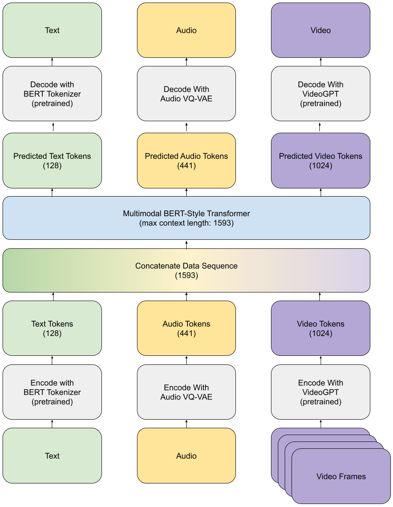
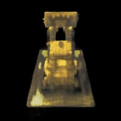

# Matthew's Project Portfolio
Email matthew[dot]dworkin[at]gmail.com for access to private repositories

## Academic Projects

<table>
    <tr>
        <td width="70%">
        <h3>Multimodal Transformer for Learning Mutual Information Across Video, Text, and Audio</h3>
        
<a href="https://github.com/MatthewDworkin/multimodal-representation/">Code</a>

        
<a href="./papers/Learning%20Multimodal%20Representations%20in%20Token%20Space.pdf">Paper</a>

        
<a href="https://www.youtube.com/watch?v=SuZBi7PrINc">Video</a>

        </td>
        <td>
        
        </td>
    </tr>
    <tr>
        <td width="70%">
        <h3>Neural Radiance Field (NeRF) for 3D Reconstruction and Novel View Generation</h3>
        
<a href="https://github.com/MatthewDworkin/NumPy-Neural-Net">Code</a>

        </td>
        <td>
        
        </td>
    </tr>
    <tr>
        <td width="70%">
        <h3>Neural Network Built from NumPy</h3>
        
<a href="https://github.com/MatthewDworkin/CS280A-proj5">Code</a>

        </td>
    </tr>
        </tr>
        <tr>
        <td width="70%">
        <h3>AI for Pacman</h3>
        
<a href="https://github.com/MatthewDworkin/cs188-proj1-search">Search Algorithms</a>

        
<a href="https://github.com/MatthewDworkin/cs188-proj4-tracking">Hidden Markov Model - Ghostbusters</a>

        
<a href="https://github.com/MatthewDworkin/cs188-proj6-reinforcement">Reinforcement/Q Learning</a>

        </td>
    </tr>
    <tr>
        <td width="70%">
        <h3>Penguin Tower Defense</h3>
        
<a href="https://github.com/evansmattis/170project">Code</a>

        </td>
    </tr>
    <tr>
        <td width="70%">
        <h3>Pairs Trading Algorithm: Capitalizing on CEF Discount Disparities During Downturns</h3>
        
<a href="https://github.com/MatthewDworkin/CEF">Code</a>

        </td>
    </tr>
</table>

## Personal Projects
- [AI Bot for Connect 4: "Connie"](https://github.com/MatthewDworkin/Connect4)
- [Web Scraper](https://github.com/MatthewDworkin/webscrape)
- [Correlation One's West Coast Regional Competition](https://github.com/we-are-never-ever-getting-back-together/C1GamesStarterKit)
